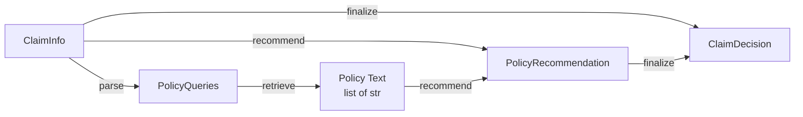

# Schemas

All data models are defined as **Pydantic v2** models in `src/claim_agent/schemas/`. They are used for API validation, pipeline state, and serialization.

## ClaimInfo

The incoming claim payload validated at the API boundary.

```python
class ClaimInfo(BaseModel):
    claim_number: str       # Unique claim identifier (e.g. "CLM-001")
    policy_number: str      # Policy number to validate against records
    claimant_name: str      # Full name of the claimant
    date_of_loss: date      # Date the loss / incident occurred
    loss_description: str   # Free-text description of the loss event
    estimated_repair_cost: float  # Claimant's estimated cost (must be > 0)
    vehicle_details: str | None = None  # Vehicle make/model/year (optional)
```

**Validation Rules:**

| Field | Rule |
|---|---|
| `estimated_repair_cost` | Must be `> 0` |
| `date_of_loss` | Accepts ISO format strings (`"2026-02-15"`) |
| `vehicle_details` | Optional, defaults to `None` |

**Example:**

```json
{
  "claim_number": "CLM-001",
  "policy_number": "PN-2",
  "claimant_name": "Jane Doe",
  "date_of_loss": "2026-02-15",
  "loss_description": "Rear-end collision at intersection, bumper damage",
  "estimated_repair_cost": 3500.00,
  "vehicle_details": "2022 Toyota Camry"
}
```

---

## ClaimDecision

The final coverage decision returned by the pipeline and the API.

```python
class ClaimDecision(BaseModel):
    claim_number: str               # Claim this decision refers to
    covered: bool                   # Whether the claim is covered
    deductible: float = 0.0         # Applicable deductible (≥ 0)
    recommended_payout: float = 0.0 # Recommended settlement (≥ 0)
    notes: str | None = None        # Explanatory notes / rejection reason
```

**Validation Rules:**

| Field | Rule |
|---|---|
| `deductible` | Must be `≥ 0`, defaults to `0.0` |
| `recommended_payout` | Must be `≥ 0`, defaults to `0.0` |
| `notes` | Optional, defaults to `None` |

---

## PolicyQueries

LLM-generated search queries for policy retrieval.

```python
class PolicyQueries(BaseModel):
    queries: list[str]  # 1–10 targeted search queries
```

**Validation Rules:**

| Field | Rule |
|---|---|
| `queries` | Must contain 1–10 items |

---

## PolicyRecommendation

LLM-generated coverage recommendation based on claim + retrieved policy text.

```python
class PolicyRecommendation(BaseModel):
    policy_section: str              # Applicable policy section
    recommendation_summary: str      # Human-readable recommendation
    deductible: float | None = None  # Deductible amount (≥ 0, optional)
    settlement_amount: float | None = None  # Settlement amount (≥ 0, optional)
```

**Validation Rules:**

| Field | Rule |
|---|---|
| `deductible` | Must be `≥ 0` if provided |
| `settlement_amount` | Must be `≥ 0` if provided |

---

## Schema Relationships



- `ClaimInfo` is the **input** to the pipeline
- `PolicyQueries` and `PolicyRecommendation` are **intermediate** models used within the pipeline
- `ClaimDecision` is the **output** returned by the API
