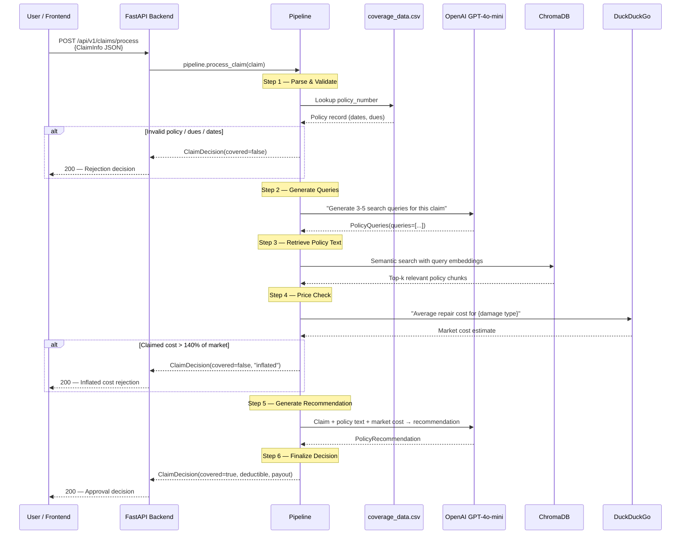
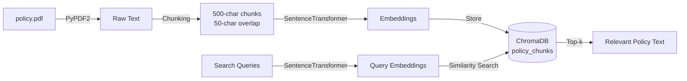

# Data Flow

This page traces a single claim through the complete processing pipeline, showing every data transformation and external call.

## End-to-End Claim Journey



## Data Transformations

### Input

```json
{
  "claim_number": "CLM-001",
  "policy_number": "PN-2",
  "claimant_name": "Jane Doe",
  "date_of_loss": "2026-02-15",
  "loss_description": "Rear-end collision, bumper and taillight damage",
  "estimated_repair_cost": 3500.00,
  "vehicle_details": "2022 Toyota Camry"
}
```

### Intermediate: Policy Queries

```json
{
  "queries": [
    "collision coverage deductible auto insurance",
    "rear-end collision bumper damage policy coverage",
    "taillight replacement insurance claim limits"
  ]
}
```

### Intermediate: Retrieved Policy Text

```
Section 4: Collision coverage applies to direct physical damage
to the insured vehicle resulting from collision with another
object or vehicle. Standard deductible: $500 per incident.
Coverage limit: $25,000 per occurrence...
```

### Intermediate: Policy Recommendation

```json
{
  "policy_section": "Section 4 — Collision Coverage",
  "recommendation_summary": "Claim covered under collision coverage.",
  "deductible": 500.0,
  "settlement_amount": 3000.0
}
```

### Output

```json
{
  "claim_number": "CLM-001",
  "covered": true,
  "deductible": 500.0,
  "recommended_payout": 3000.0,
  "notes": "Claim covered under collision coverage.\n\n--- Processing Trace ---\n  [parse_claim] 0.01s\n  [validate_claim] 0.05s\n  [check_policy] 2.31s\n  [price_check] 1.45s\n  [generate_recommendation] 1.89s\n  [finalize_decision] 0.00s"
}
```

## Rejection Paths

There are three ways a claim can be rejected:

### 1. Validation Failure

- **Policy not found**: Policy number doesn't exist in CSV
- **Outstanding dues**: `premium_dues_remaining == True`
- **Expired coverage**: `date_of_loss` outside `[coverage_start, coverage_end]`

### 2. Inflated Cost

The price check compares the claimant's `estimated_repair_cost` against web search results. If the claimed cost exceeds the market estimate by more than 40% (configurable via `price_check.inflation_threshold`), the claim is rejected.

### 3. LLM Recommendation

In rare cases, the LLM may recommend rejection based on policy exclusions or other coverage limitations discovered in the retrieved policy text.

## Vector Store (ChromaDB)



| Parameter | Value |
|---|---|
| Embedding Model | `all-MiniLM-L6-v2` (384 dimensions) |
| Chunk Size | 500 characters |
| Chunk Overlap | 50 characters |
| Results per Query | 5 (configurable) |
| Persistence | `data/chroma_db/` directory |
