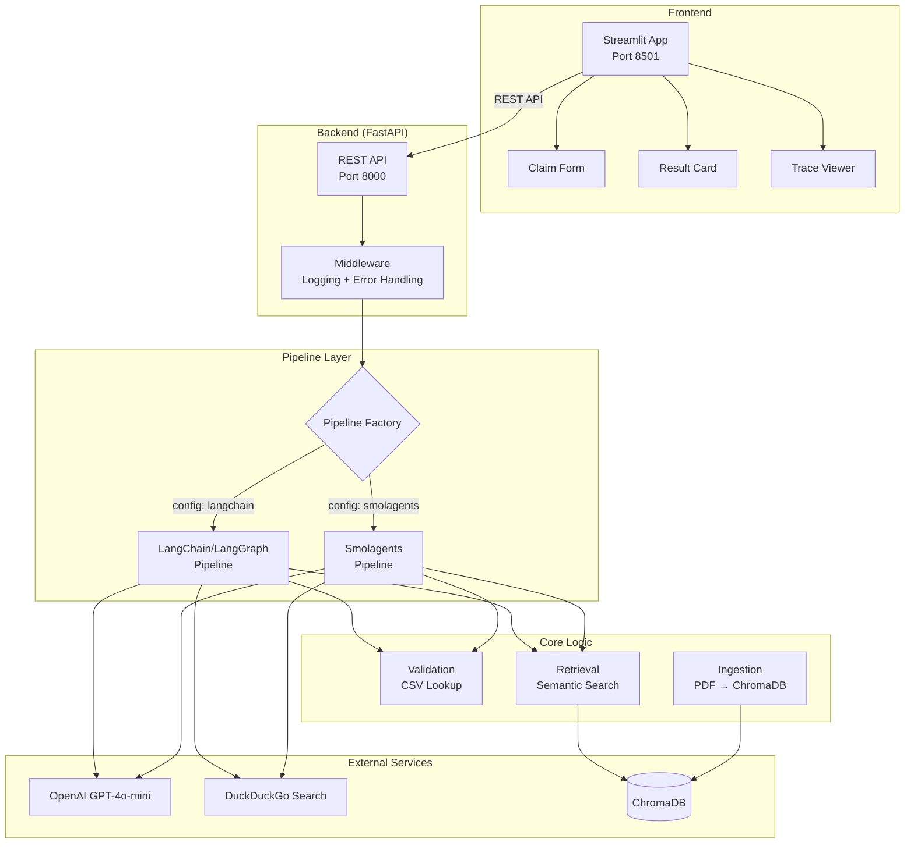
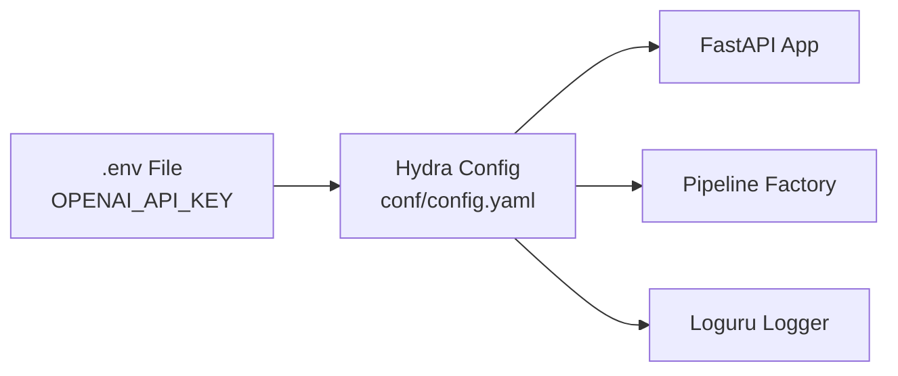

# Architecture Overview

The Claim Processing Agent is a full-stack application with a clear separation between the AI/business logic backend and the user-facing frontend.

## System Architecture

## Component Responsibilities

### Frontend (Streamlit)

The frontend communicates with the backend **exclusively via REST API** — no direct Python imports from the backend.

| Component | File | Responsibility |
|---|---|---|
| Main App | `frontend/app.py` | Page layout, sidebar, orchestration |
| Claim Form | `frontend/components/claim_form.py` | Form + JSON input modes |
| Result Card | `frontend/components/result_card.py` | Coverage decision display |
| Trace Viewer | `frontend/components/trace_viewer.py` | Agent step-by-step trace |
| API Client | `frontend/api_client.py` | HTTP client wrapper |
| Styles | `frontend/styles.py` | CSS injection |

### Backend (FastAPI)

| Component | File | Responsibility |
|---|---|---|
| App Factory | `src/claim_agent/api/app.py` | Build FastAPI app with lifespan |
| Routes | `src/claim_agent/api/routes/claims.py` | API endpoints |
| Middleware | `src/claim_agent/api/middleware.py` | Request logging, error handling |
| Entry Point | `src/claim_agent/main.py` | Hydra + Uvicorn bootstrap |

### Pipeline Layer

| Component | File | Responsibility |
|---|---|---|
| Base Interface | `src/claim_agent/pipelines/base.py` | Abstract `BasePipeline` ABC |
| Factory | `src/claim_agent/pipelines/factory.py` | Instantiate by config |
| LangChain Pipeline | `src/claim_agent/pipelines/langchain_pipeline/` | Deterministic graph |
| Smolagents Pipeline | `src/claim_agent/pipelines/smolagents_pipeline/` | Autonomous agent |

### Core Business Logic

| Component | File | Responsibility |
|---|---|---|
| Validation | `src/claim_agent/core/validation.py` | CSV policy lookup |
| Ingestion | `src/claim_agent/core/ingestion.py` | PDF → chunks → ChromaDB |
| Retrieval | `src/claim_agent/core/retrieval.py` | Semantic similarity search |

### Schemas

| Model | File | Used For |
|---|---|---|
| `ClaimInfo` | `src/claim_agent/schemas/claim.py` | Incoming claim data |
| `ClaimDecision` | `src/claim_agent/schemas/claim.py` | Final coverage decision |
| `PolicyQueries` | `src/claim_agent/schemas/policy.py` | LLM-generated search queries |
| `PolicyRecommendation` | `src/claim_agent/schemas/policy.py` | LLM coverage recommendation |

## Configuration Flow

All configuration is handled by **Hydra** with YAML files. The pipeline type (`langchain` or `smolagents`) is selected via `conf/config.yaml` defaults. API keys are injected from environment variables using OmegaConf interpolation.
