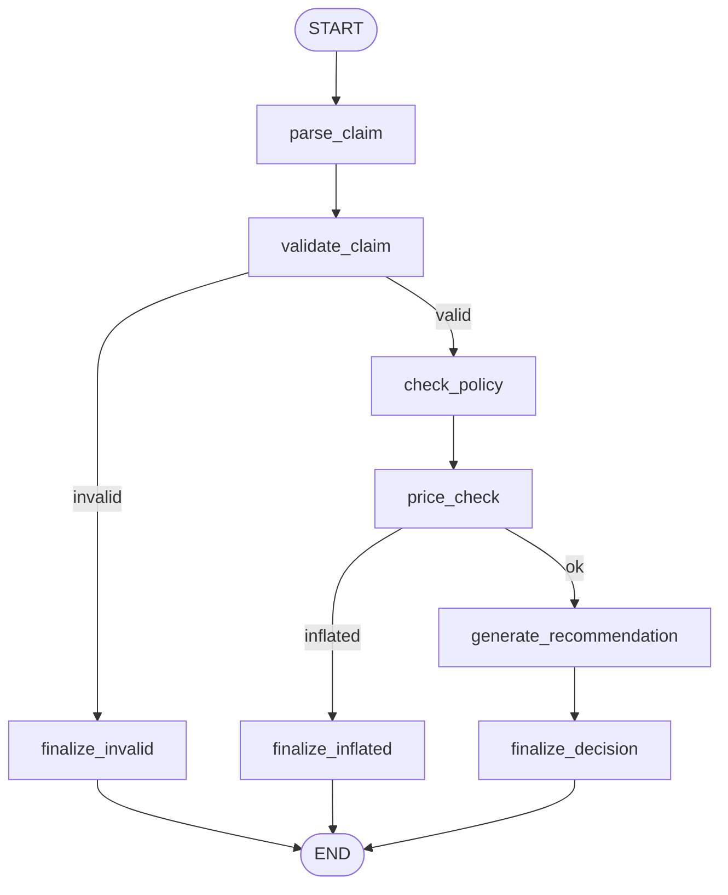
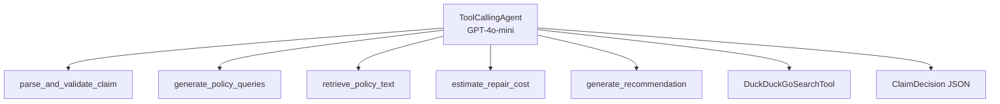

# Pipelines

The system implements two interchangeable claim-processing pipelines. Both accept a `ClaimInfo` and produce a `ClaimDecision`. The active pipeline is selected via configuration — no code changes required.

## Pipeline Interface

```python
class BasePipeline(ABC):
    """Contract for interchangeable claim-processing pipelines."""

    def __init__(self, cfg: DictConfig) -> None:
        self.cfg = cfg

    @abstractmethod
    def process_claim(self, claim: ClaimInfo) -> ClaimDecision:
        """Run the full claim-processing workflow and return a decision."""
        ...
```

Both pipelines inherit from `BasePipeline` and implement `process_claim()`.

## Pipeline 1: LangChain/LangGraph

The LangChain pipeline uses **LangGraph's `StateGraph`** for explicit, deterministic orchestration. Each processing step is a graph node, with conditional edges encoding the business logic.

### Graph Topology



### Graph State

The graph carries a `ClaimState(TypedDict)` through all nodes:

| Field | Type | Set By |
|---|---|---|
| `claim_data` | `dict` | Input |
| `claim` | `ClaimInfo` | `parse_claim` |
| `is_valid` | `bool` | `validate_claim` |
| `validation_reason` | `str` | `validate_claim` |
| `policy_queries` | `PolicyQueries` | `check_policy` |
| `policy_text` | `list[str]` | `check_policy` |
| `market_cost_estimate` | `float` | `price_check` |
| `is_inflated` | `bool` | `price_check` |
| `recommendation` | `PolicyRecommendation` | `generate_recommendation` |
| `decision` | `ClaimDecision` | `finalize_*` |
| `trace` | `list[dict]` | All nodes |

### Tools

| Tool | Purpose |
|---|---|
| `parse_claim` | Validates JSON against `ClaimInfo` schema |
| `validate_claim_tool` | Checks policy CSV (exists, dues, dates) |
| `generate_policy_queries` | LLM generates 3–5 semantic search queries |
| `retrieve_policy_text_tool` | ChromaDB similarity search |
| `web_search_repair_cost` | DuckDuckGo market price lookup |
| `generate_recommendation` | LLM coverage recommendation |

### Key Design Decisions

- **Explicit graph over chains**: The `StateGraph` maps directly to the workflow diagram, making the flow deterministic and debuggable.
- **Conditional edges**: Business logic (invalid policy, inflated cost) causes graph branching at `validate_claim` and `price_check` nodes.
- **Execution tracing**: Every node records its name, entry time, and elapsed time in the `trace` list for observability.

---

## Pipeline 2: Smolagents

The Smolagents pipeline uses **HuggingFace's `smolagents` library** with a `ToolCallingAgent`. Instead of explicit graph edges, the agent autonomously decides which tools to call and in what order.

### Agent Architecture



### Tools

All tools are `@tool`-decorated functions that accept and return JSON strings (for serialization compatibility with smolagents):

| Tool | Purpose |
|---|---|
| `parse_and_validate_claim` | Parse JSON + CSV validation |
| `generate_policy_queries` | LLM query generation |
| `retrieve_policy_text` | ChromaDB semantic search |
| `estimate_repair_cost` | DuckDuckGo price lookup |
| `generate_recommendation` | LLM coverage recommendation |
| `DuckDuckGoSearchTool` | Built-in web search |

### Custom Prompt Templates

The agent receives custom `PromptTemplates` with:

- **System prompt**: Enforces strict sequential workflow order
- **Planning prompt**: Guides the agent's reasoning between steps
- **Final answer prompt**: Instructs JSON output format

### Output Parsing

Since the agent returns free-form text, the pipeline includes multi-stage parsing:

1. **JSON extraction**: Attempt to parse markdown-fenced or bare JSON
2. **Fuzzy extraction**: Regex-based field extraction from free text
3. **Safe fallback**: Return `covered=False` with explanation if all parsing fails

### Key Design Decisions

- **Fresh agent per invocation**: Avoids stale state between claims
- **`planning_interval=2`**: Agent re-plans every 2 steps for better reasoning
- **`max_steps` limit**: Prevents infinite loops (configurable, default 10)

---

## Switching Pipelines

```yaml title="conf/config.yaml"
defaults:
  - pipeline: langchain    # ← change to 'smolagents'
```

That's it. Both pipelines consume the same data sources, use the same Pydantic schemas, and produce the same `ClaimDecision` output.

## Comparison

| Aspect | LangChain/LangGraph | Smolagents |
|---|---|---|
| **Orchestration** | Explicit graph edges | LLM-driven autonomous |
| **Determinism** | High — same inputs, same path | Lower — agent may vary |
| **Observability** | Full node-level trace | Agent reasoning log |
| **Error Handling** | Conditional edges | System prompt constraints |
| **Flexibility** | Must modify graph for new flows | Agent adapts autonomously |
| **Best For** | Production, compliance | Research, demo, flexibility |
