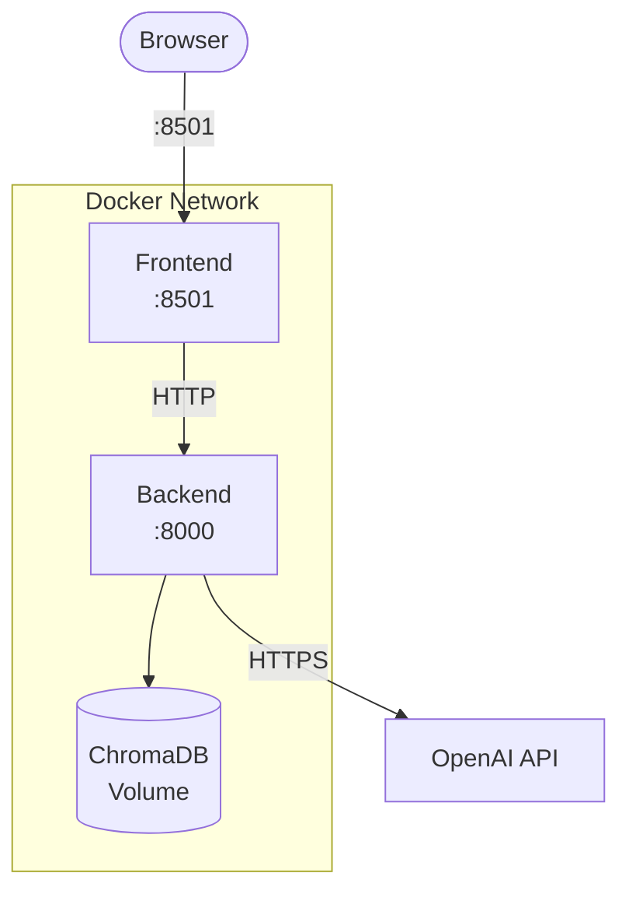

# Docker Deployment

Deploy the full stack (backend + frontend) with Docker Compose.

## Prerequisites

- Docker Engine 24+
- Docker Compose v2
- An `.env` file with your `OPENAI_API_KEY`

## Quick Deploy

```bash
# Build images
make docker-build

# Start services (detached)
make docker-up

# Check health
curl http://localhost:8000/api/v1/health
```

Open [http://localhost:8501](http://localhost:8501) to access the Streamlit UI.

## Architecture



## Docker Compose Services

```yaml title="docker-compose.yml"
services:
  backend:
    build: .
    ports: ["8000:8000"]
    env_file: [{ path: .env, required: false }]
    volumes: [chroma_data:/app/data/chroma_db]
    healthcheck:
      test: ["CMD", "curl", "-f", "http://localhost:8000/api/v1/health"]
      interval: 30s
      start_period: 60s

  frontend:
    build: ./frontend
    ports: ["8501:8501"]
    environment:
      - API_BASE_URL=http://backend:8000
    depends_on:
      backend:
        condition: service_healthy
```

## Backend Dockerfile

The backend uses a **multi-stage build** to minimize image size:

| Stage | Purpose | Base Image |
|---|---|---|
| **builder** | Install Poetry + dependencies | `python:3.12-slim` |
| **runtime** | Copy venv + app code | `python:3.12-slim` |

Key features:

- Production-only dependencies (dev group excluded)
- Health check on `/api/v1/health`
- Copies `src/`, `conf/`, `data/coverage_data.csv`, and `data/policy.pdf`
- ChromaDB data stored in a Docker volume for persistence

## Frontend Dockerfile

- Single-stage `python:3.12-slim` build
- Installs `streamlit` and `requests` via pip
- Health check on `/_stcore/health`
- Runs with `--server.headless=true`

## Persistent Storage

ChromaDB data is stored in a named Docker volume (`chroma_data`) so vector embeddings persist across container restarts:

```yaml
volumes:
  chroma_data:
    driver: local
```

!!! info "First-Run Ingestion"
    On first startup, the backend automatically ingests `data/policy.pdf` into ChromaDB if the collection is empty.

## Useful Commands

```bash
# Build images
docker compose build

# Start in foreground (with logs)
docker compose up

# Start detached
docker compose up -d

# View logs
docker compose logs -f backend
docker compose logs -f frontend

# Stop services
docker compose down

# Stop and remove volumes
docker compose down -v

# Rebuild a single service
docker compose build backend
docker compose up -d backend
```

## Environment Variables

Create a `.env` file in the project root:

```dotenv
OPENAI_API_KEY=sk-your-key-here
```

The backend reads this via the `env_file` directive. The frontend receives the backend URL via the `API_BASE_URL` environment variable (set to `http://backend:8000` in compose).

## Troubleshooting

??? question "Backend health check fails during startup"
    The backend needs ~60 seconds on first run to load the embedding model and ingest the PDF. The `start_period: 60s` in the health check accounts for this. If it still fails, increase `start_period`.

??? question "Frontend can't reach the backend"
    Both services must be on the same Docker network (`claim-network`). Verify with:
    ```bash
    docker compose exec frontend curl http://backend:8000/api/v1/health
    ```

??? question "ChromaDB data lost between restarts"
    Ensure the `chroma_data` volume is defined and mounted. Check with `docker volume ls`.
