# Claim Processing Agent

<div style="text-align: center; margin: 2rem 0;">
  <h2 style="margin-bottom: 0.5rem;">🏛️ Agentic RAG Insurance Claim Processor</h2>
  <p style="color: var(--md-default-fg-color--light); font-size: 1.1em;">
    Production-grade AI system that automates insurance claim evaluation using<br>
    dual agentic pipelines, vector search, and web-augmented reasoning.
  </p>
</div>

---


## What It Does

The **Claim Processing Agent** accepts structured insurance claims (JSON), validates them against policy records (CSV), retrieves relevant policy language from insurance documents (PDF) via semantic vector search, estimates repair costs using web search, and produces structured coverage decisions — all orchestrated by an AI agent.

```mermaid
graph LR
    A[📋 Claim JSON] --> B{Parse & Validate}
    B -->|Invalid| C[❌ Reject]
    B -->|Valid| D[🔍 Policy Retrieval]
    D --> E[💰 Price Check]
    E -->|Inflated| C
    E -->|OK| F[🤖 LLM Recommendation]
    F --> G[✅ Coverage Decision]
```



## Key Features

<div class="tech-grid" markdown>

<div class="tech-card" markdown>
#### 🔄 Dual Pipelines
Switch between **LangChain/LangGraph** (deterministic graph) and **Smolagents** (autonomous agent) via a single config change.
</div>

<div class="tech-card" markdown>
#### 📄 RAG-Powered
Semantic search over insurance policy PDFs using **ChromaDB** and **OpenAI embeddings** (`text-embedding-3-small`).
</div>

<div class="tech-card" markdown>
#### 🌐 Web-Augmented
Real-time repair cost estimation via **DuckDuckGo** web search to detect inflated claims.
</div>

<div class="tech-card" markdown>
#### 🖥️ Full-Stack
**FastAPI** REST backend + **Streamlit** frontend with processing trace viewer.
</div>

<div class="tech-card" markdown>
#### 🐳 Docker Ready
Multi-stage Docker builds with **docker-compose** orchestration, health checks, and persistent volumes.
</div>

<div class="tech-card" markdown>
#### ✅ Tested
**58 tests** covering schemas, validation, retrieval, both pipelines, and API endpoints.
</div>

</div>

## Tech Stack

| Layer | Technology |
|---|---|
| **Language** | Python 3.12 |
| **LLM** | OpenAI GPT-4o-mini |
| **Pipelines** | LangChain/LangGraph, Smolagents |
| **Vector Store** | ChromaDB + all-MiniLM-L6-v2 |
| **Backend** | FastAPI + Uvicorn |
| **Frontend** | Streamlit |
| **Config** | Hydra + OmegaConf |
| **Logging** | Loguru (colored console + structured JSON) |
| **Deps** | Poetry |
| **Deployment** | Docker + docker-compose |
| **Testing** | pytest + pytest-asyncio + httpx |
| **Linting** | Ruff + mypy |

## Quick Start

```bash
# Clone and install
git clone https://github.com/zarreh/auto_insurance_claim_agent.git
cd claim_process_agent
make install

# Set your API key
cp .env.example .env
# Edit .env and add your OPENAI_API_KEY

# Ingest the policy PDF into the vector store
make ingest

# Start the backend + frontend
make run
```

Then open [http://localhost:8504](http://localhost:8504) in your browser.

Or visit the live deployment at **[https://claim-agent.zarreh.ai](https://claim-agent.zarreh.ai)**.

→ See the full [Quick Start Guide](getting-started/quickstart.md) for details.

## Project Structure

```
claim_process_agent/
├── conf/                     # Hydra configuration
├── data/                     # CSV policy records, policy PDF
├── src/claim_agent/          # Python package
│   ├── schemas/              # Pydantic models (ClaimInfo, ClaimDecision, ...)
│   ├── core/                 # Business logic (validation, ingestion, retrieval)
│   ├── pipelines/            # LangChain + Smolagents implementations
│   ├── api/                  # FastAPI application, routes, middleware
│   └── logging/              # Loguru setup
├── frontend/                 # Streamlit UI
├── tests/                    # 58 tests (unit + integration)
├── docs/                     # MkDocs documentation (you are here)
├── Dockerfile                # Backend multi-stage build
├── docker-compose.yml        # Full-stack orchestration
└── Makefile                  # Developer workflow commands
```

## License

This project is built as a portfolio demonstration for the Johns Hopkins University Agentic AI course.
